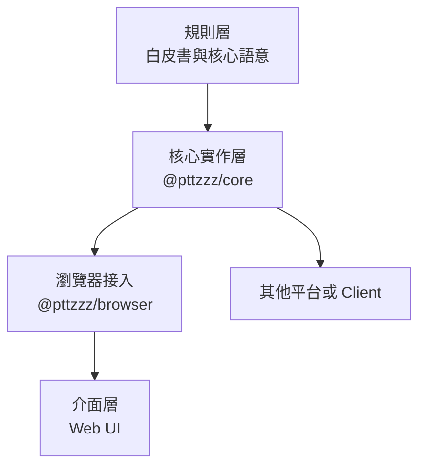

# pttzzz

<p align="center">
  <strong>一起推進PTTZ計畫。</strong>
</p>

<p align="center">
  
  
  
  
</p>

> 共同打造新生的PTT社群，透過終端頁面重新解析，讓PTT能轉型成更現代化的社群論壇。合併分散回文、回文嵌套回覆、純推噓、回文編輯收回⋯，我們的野心沒有終點

## 關於

pttzzz 是一個實作 PTT 客戶端介面的提案，核心訴求在於提供一套對回文的解析規則，讓現有 PTT 的文章、推文與操作紀錄能夠被重新解析、排版成現代論壇。

這個提案，也包含對規則集的客戶端核心層的實作，與以此核心層為底的網頁介面層實作。

我相信在AI coding的時代，任何人能都能基於這套規則集，來做出符合自己喜好的 PTT 客戶端。

## 核心提案

### 🧩 分散推文聚合

PTT 的單行長度限制經常把一段完整發言拆成多筆推文。我們提案依作者、時間、回覆對象、終止符與終端欄位等資訊，將原本屬於同一段話的片段重新合併。

### 🌲 嵌套回文

PTT 的推文依時間排列，卻難以直接看出一句話正在回應誰。我們提案辨識推文中的回覆意圖，把扁平的回文序列還原成具有嵌套結構討論串，讓讀者能沿著對話關係理解爭論、補充與延伸，而不必在樓號之間來回尋找。

### 👍 文章推噓與回文推噓

PTT 原生推噓只能直接表達對整篇文章的態度，無法清楚評價討論中的某一則觀點。我們提案區分文章推噓與回文推噓，保留文章整體評價，也讓參與者能對個別回文表示贊同或反對。

此外我們容許對文章的一鍵推或噓，降低社群的互動門檻。

### ✏️ 回文編輯與撤回

PTT 的回文送出後便無法直接修改。我們提案讓使用者可以透過控制格式補充、更正或撤回自己先前的回文。

## 簡單範例

原始 PTT 推文可能是：

```text
1F  → alice: 我覺得這個功能                    10:01
2F  → bob: 我倒是沒什麼感覺                    10:02
3F  → alice: 對閱讀體驗幫助很大                10:03
4F  → dora: 回1樓：同意，長討論會清楚很多      10:04
5F  → erin: 推1樓                               10:05
```

經過規則解析後，可以呈現為：

```text
alice  推 +1
我覺得這個功能
對閱讀體驗幫助很大
└─ dora
   同意，長討論會清楚很多

bob
我倒是沒什麼感覺
```

| 原始 PTT | pttzzz |
| --- | --- |
| 線性推文序列 | 嵌套討論結構 |
| 因單行限制而拆散的發言 | 聚合成完整回文 |
| `回1樓` | 明確的回覆關係 |
| `推1樓` | 對特定回文表達贊同 |
| 回文送出後無法修改 | 可補充、更正或撤回 |

完整的原始事件與介面對照請見[核心規則案例集](docs/whitepaper/core-rules-examples.html)。

## 三層提案與目前實作

pttzzz 將規則、核心解析邏輯與使用者介面分離，使這一套解析規則可以支援不同平台與 UI。



目前專案庫的對應如下：

| 層級 | 目前版本 | 位置 | 用途 |
| --- | --- | --- | --- |
| 規則層 | 規則 `0.4.0` | [`docs/whitepaper/`](docs/whitepaper/) | 白皮書與完整畫面案例 |
| 核心實作層 | `@pttzzz/core` `0.3.0` | [`packages/core/`](packages/core/) | 平台無關的資料契約、解析規則與 `PttzzzClient` |
| 核心實作層的瀏覽器接入 | `@pttzzz/browser` `0.3.0` | [`packages/browser/`](packages/browser/) | 透過 `ptt-client` 與 PTT WebSocket 連線，實作瀏覽器閘道器 |
| 介面層範例 | `@pttzzz/web-example` `0.3.0` | [`apps/web/`](apps/web/) | React 網頁介面，示範如何使用核心實作 |

`@pttzzz/core` 不依賴 React、瀏覽器或 `ptt-client`；其他介面可以直接依照公開契約建立自己的呈現方式。更完整的套件邊界請見[核心架構](packages/core/docs/README.md)與 [UI 開發指南](packages/core/docs/DEVELOPMENT_GUIDE.md)。

規則、核心套件與介面各自採語意化版本。實作會在 package metadata 的 `pttzzz` 欄位宣告所支援的 core、browser 與規則版本；目前三層相容於規則 `0.4.x`。

## 使用基於 pttzzz 規則實作的客戶端

需求：Node.js 20 以上版本。

```bash
npm install
npm run build:packages
npm run dev:ptt
```

開發伺服器會同時提供網頁與 `/ptt-ws` 代理。`dev:ptt` 連接正式 PTT；`dev:local` 連接本機 Telnet 測試環境。`npm run dev` 依設定選擇，預設本機。設定方式與測試帳號管理請見[本機 PTT 開發環境](apps/web/docs/local-ptt.md)。

## 開發指引

可依照三層責任選擇需參閱之文件：

- **從核心層實作**：請參閱[提案白皮書](docs/whitepaper/pttzzz-core.md)，再使用[規則案例契約](docs/fixtures/thread-events/README.md)與 `manifest.json`。每個 fixture 都是與語言及框架無關的輸入／預期結果；實作方應先驗證 JSON 契約與 Rule ID，再逐欄比較解析結果。現有核心的驗證命令如下：

  ```bash
  npm test -w @pttzzz/core -- --run src/whitepaperFixtures.test.ts
  ```

  自行實作其他核心時，請使用 fixture 驗證，將 `rawPushes`、`articleBody` 與其他輸入轉成自己的模型，再把輸出轉成 fixture 定義的比較格式；不要先替 fixture 套用規則，也不要為了符合既有程式而修改 `expected`。

- **從介面層實作**：使用 `@pttzzz/core` 與適合的 gateway（目前瀏覽器版本為 `@pttzzz/browser`），只消費公開 DTO 與事件，不自行解析 PTT 終端文字、不自行產生控制格式。請先閱讀[核心套件契約](packages/core/docs/contracts.md)與[UI 開發指南](packages/core/docs/DEVELOPMENT_GUIDE.md)；後者包含連線、訂閱、文章讀取、寫入、錯誤處理與 cleanup 的最小整合方式。

- **目前 Web 介面範例**：呈現深度、UI 取捨與開發預覽工具集中在[Web 介面層實作說明](apps/web/docs/README.md)。這些內容只約束此 Web 範例，不會改變白皮書或核心資料語意。

常用指令：

```bash
npm run dev       # 啟動網頁與 PTT 代理，預設本機
npm run dev:local # 明確選擇本機 Telnet 測試環境
npm run dev:ptt   # 明確選擇正式 PTT WebSocket
npm run build     # TypeScript 檢查與正式環境建置
npm run test      # 執行所有測試
npm run lint      # 執行 ESLint
npm run verify    # 測試、建置、lint 與套件 smoke test
```

### 驗證白皮書 fixture

`docs/fixtures/thread-events/` 是與實作無關的規則案例集。自行實作核心解析器時，先依 `schema.json` 驗證 JSON 形狀與 Rule ID，再把原始輸入交給自己的實作，逐欄比較 `expected` 與其他可選期望欄位；不要預先替 fixture 套用規則，也不要為了符合既有程式而修改 `expected`。

本 repository 的驗證命令、覆蓋檢查與結果判讀集中在[核心實作 README](packages/core/docs/README.md#fixture-符合性驗證)。

## 文件導覽

- [提案白皮書](docs/whitepaper/pttzzz-core.md)：規範核心語意、Rule ID 與系統風險。
- [核心規則案例集](docs/whitepaper/core-rules-examples.html)：原始 PTT 事件與解析結果的視覺對照。
- [規則案例契約](docs/fixtures/thread-events/README.md)：可供不同核心實作驗證的 fixtures。
- [核心套件契約](packages/core/docs/contracts.md)：公開資料與操作介面。
- [UI 開發指南](packages/core/docs/DEVELOPMENT_GUIDE.md)：協助開發者與 AI 使用現有核心建立客製介面。
- [Web 介面層實作說明](apps/web/docs/README.md)：目前 UI 的呈現取捨與開發細節。

## 專案狀態

pttzzz 目前仍在積極開發，解析規則、公開套件介面與參考 UI 會持續調整。它不是 PTT 官方專案；實際連線與操作仍受 PTT 本身的看板規則、連線狀態與終端介面變更影響。

這場改造，沒有終點。
