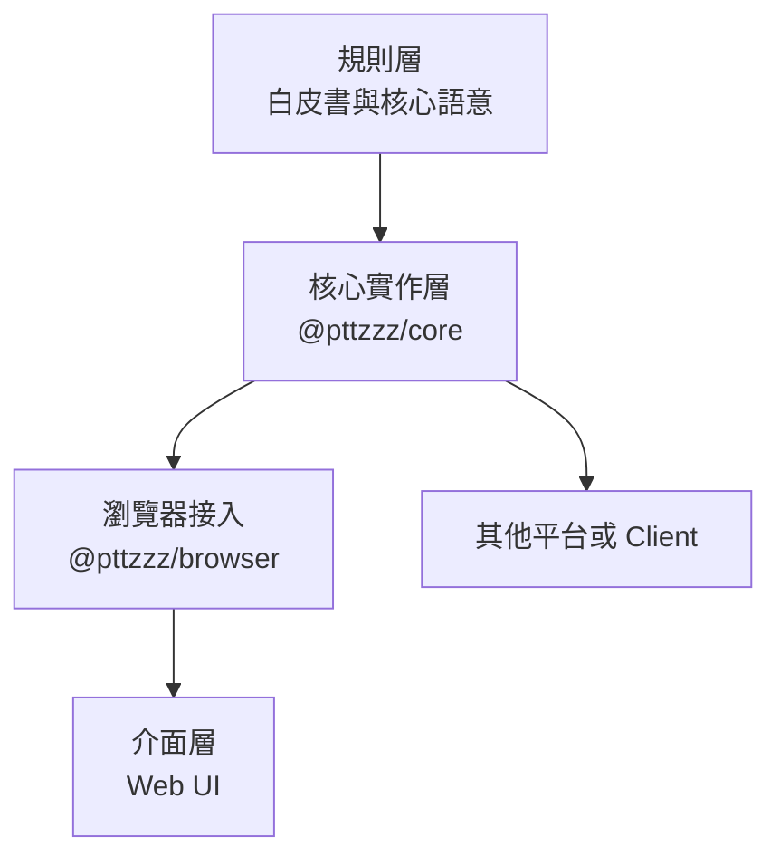

# pttzzz

<p align="center">
  <strong>讓我們一同打造新生的 PTT。</strong>
</p>

<p align="center">
  
  
  
  
</p>

> 我們提案重新解析終端頁面，讓 PTT 在保有原始文化的同時，往現代化社群論壇推進。合併分散推文、建立嵌套回文、加入回文推噓與回文編輯 —— 這些只是開始。
>
> 我們不只想讓 PTT 繼續存在，更要推動它重生，成為下一個世代依然充滿生命力的社群。
>
> 這場改造，沒有終點。

pttzzz 是一個提案，能從讓現有的 PTT 終端內容，將文章、推文與操作紀錄，重新解讀成更棒的樣子。

除了提案外，另外包含一套對於這個提案的核心實作，以及一套網頁介面實作。

## 核心提案

### 🧩 分散推文聚合

PTT 的單行長度限制經常把一段完整發言拆成多筆推文。我們提案依作者、時間、回覆對象、終止符與終端欄位等資訊，將原本屬於同一段話的片段重新合併。

### 🌲 嵌套回文

PTT 的推文依時間排列，卻難以直接看出一句話正在回應誰。我們提案辨識推文中的回覆意圖，把線性事件還原成具有上下文的嵌套討論，讓讀者能沿著對話關係理解爭論、補充與延伸，而不必在樓號之間來回尋找。

### 👍 文章推噓與回文推噓

PTT 原生推噓只能直接表達對整篇文章的態度，無法清楚評價討論中的某一則觀點。我們提案區分文章推噓與回文推噓，保留文章整體評價，也讓參與者能對具體回文表示贊同或反對。

此外我們容許對文章的一鍵推或噓，降低社群的互動門檻。

### ✏️ 回文編輯與撤回

PTT 的回文送出後便無法直接修改。我們提案讓使用者可以透過控制格式補充、更正或撤回自己先前的回文。

## 簡單範例

原始 PTT 推文可能是：

```text
1F  → alice: 我覺得這個功能                    10:01
2F  → bob: 我倒是沒什麼感覺                    10:02
3F  → alice: 對閱讀體驗幫助很大                10:03
4F  → dora: 回1樓：同意，長討論會清楚很多      10:04
5F  → erin: 推1樓                               10:05
```

經過規則解析後，可以呈現為：

```text
alice  推 +1
我覺得這個功能
對閱讀體驗幫助很大
└─ dora
   同意，長討論會清楚很多

bob
我倒是沒什麼感覺
```

| 原始 PTT | pttzzz |
| --- | --- |
| 線性推文序列 | 嵌套討論結構 |
| 因單行限制而拆散的發言 | 聚合成完整回文 |
| `回1樓` | 明確的回覆關係 |
| `推1樓` | 對特定回文表達贊同 |
| 回文送出後無法修改 | 可補充、更正或撤回 |

完整的原始事件與介面對照請見[核心規則案例集](docs/whitepaper/core-rules-examples.html)。

## 三層提案與目前實作

pttzzz 將規則、核心解析邏輯與使用者介面分離，使這一套解析規則可以支援不同平台與 UI。



目前專案庫的對應如下：

| 層級 | 位置 | 用途 |
| --- | --- | --- |
| 規則層 | [`docs/whitepaper/`](docs/whitepaper/) | 白皮書與完整畫面案例 |
| 核心實作層 | [`packages/core/`](packages/core/) | 平台無關的資料契約、解析規則與 `PttzzzClient` |
| 核心實作層的瀏覽器接入 | [`packages/browser/`](packages/browser/) | 透過 `ptt-client` 與 PTT WebSocket 連線，實作瀏覽器閘道器 |
| 介面層範例 | [`apps/web/`](apps/web/) | React 網頁介面，示範如何使用核心實作 |

`@pttzzz/core` 不依賴 React、瀏覽器或 `ptt-client`；其他介面可以直接依照公開契約建立自己的呈現方式。更完整的套件邊界請見[核心架構](packages/core/docs/architecture.md)與 [AI 介面指南](packages/core/docs/AI-INTERFACE.md)。

## 開始使用

需求：Node.js 20 以上版本。

```bash
npm install
npm run dev
```

開發伺服器會同時提供網頁與 `/ptt-ws` WebSocket 代理。瀏覽器仍是直接連線到 PTT；代理只負責加入 PTT WebSocket 所需的 `Origin` 標頭。

常用指令：

```bash
npm run dev       # 啟動網頁與 PTT WebSocket 代理
npm run build     # TypeScript 檢查與正式環境建置
npm run test      # 執行所有測試
npm run lint      # 執行 ESLint
npm run verify    # 測試、建置、lint 與套件 smoke test
```

不登入 PTT 也可以使用預覽模式檢視介面：

- `?preview=home`
- `?preview=board`
- `?preview=article`
- `?preview=login`

## 文件導覽

- [提案白皮書](docs/whitepaper/pttzzz-core.md)：規範核心語意、Rule ID 與系統風險。
- [核心規則案例集](docs/whitepaper/core-rules-examples.html)：原始 PTT 事件與解析結果的視覺對照。
- [規則案例契約](docs/fixtures/thread-events/README.md)：可供不同核心實作驗證的 fixtures。
- [核心套件契約](packages/core/docs/contracts.md)：公開資料與操作介面。
- [核心實作符合性](packages/core/docs/fixture-conformance.md)：如何比較實作與白皮書 fixture。
- [AI 介面指南](packages/core/docs/AI-INTERFACE.md)：協助 AI 或開發者建立其他 UI 實作。

## 專案狀態

pttzzz 目前仍在積極開發，解析規則、公開套件介面與參考 UI 會持續調整。它不是 PTT 官方專案；實際連線與操作仍受 PTT 本身的看板規則、連線狀態與終端介面變更影響。

這場改造，沒有終點。
