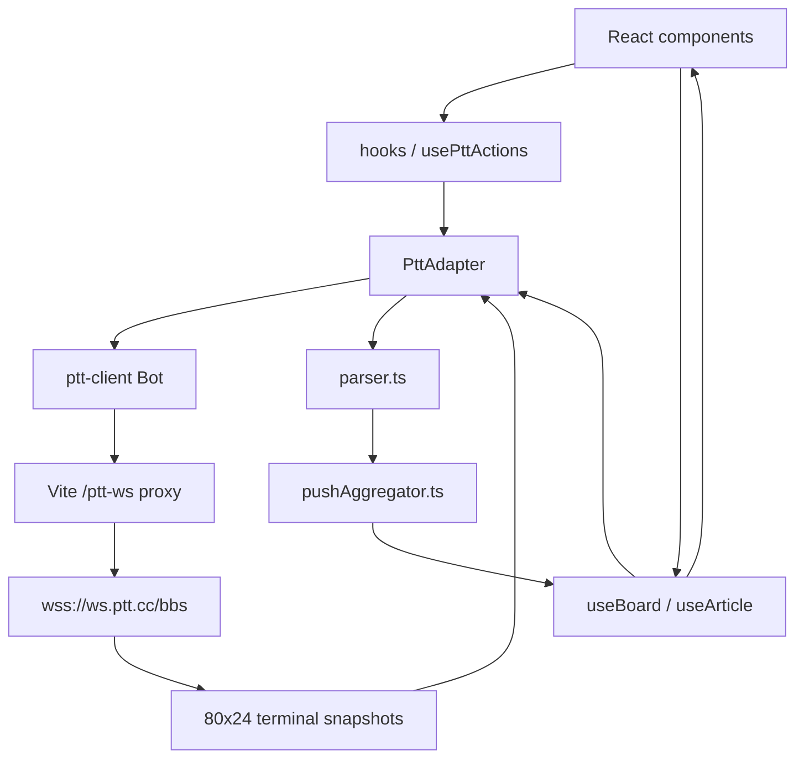
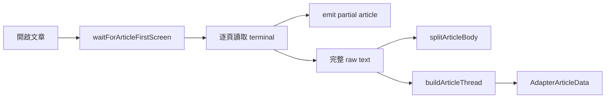

# PTTzzz Code Architecture Guide

這份指南用於直接閱讀與修改 PTTzzz 程式碼。內容以目前 `bugfix/goal-7-reply-vote-controls` 分支為準。

## 1. 先建立正確心智模型

PTTzzz 是純前端 React 應用程式，但它不是一般 REST API 前端。瀏覽器內的 `ptt-client` 會操作一個 80×24 的 PTT terminal，程式必須：

1. 送出按鍵。
2. 等待 terminal 畫面改變。
3. 從文字快照判斷目前狀態。
4. 解析文章、推文與操作結果。
5. 將原始推文轉成 PTTzzz 的聚合討論串。



最重要的邊界是 [`PttAdapter`](../src/lib/ptt/adapter.ts)：UI 與 hooks 不應直接操作 terminal 按鍵。

## 2. 啟動與常用指令

```bash
npm run dev
npm test
npm run build
npm run lint
```

開發伺服器同時提供 `/ptt-ws` WebSocket proxy。PTT 會檢查 WebSocket `Origin`，因此 [`vite.config.ts`](../vite.config.ts) 將 upstream request 的 Origin 設為 `https://term.ptt.cc`。

### UI 預覽模式

不連 PTT，只顯示 [`App.tsx`](../src/App.tsx) 內建資料：

- `?preview=home`
- `?preview=board`
- `?preview=article`
- `?preview=login`

### Fake PTT 模式

使用 [`fakeAdapter.ts`](../src/lib/ptt/fakeAdapter.ts) 和 local/session storage，會實際走 adapter 介面與解析流程：

```text
?mockPtt=1&mockUser=alice
```

多個分頁可指定不同 `mockUser` 測試多帳號互動。Preview 適合看 UI；Fake PTT 適合測試讀寫行為。

## 3. 目錄地圖

| 路徑 | 責任 |
|---|---|
| [`src/App.tsx`](../src/App.tsx) | 頂層 view state、頁面切換、發文／編輯／回應流程 |
| [`src/components/`](../src/components) | 畫面與局部互動狀態 |
| [`src/hooks/`](../src/hooks) | React 與 adapter 之間的資料／操作橋接 |
| [`src/lib/ptt/adapter.ts`](../src/lib/ptt/adapter.ts) | PTT 連線、terminal 操作、看板與文章讀寫、partial parsing |
| [`src/lib/ptt/parser.ts`](../src/lib/ptt/parser.ts) | 低階 ANSI、文章正文、raw push 與編輯紀錄解析 |
| [`src/lib/ptt/pushAggregator.ts`](../src/lib/ptt/pushAggregator.ts) | 推文 intent、聚合、巢狀回覆、投票、撤回與 score |
| [`src/lib/ptt/viewCache.ts`](../src/lib/ptt/viewCache.ts) | 記憶體內看板／文章／scroll cache |
| [`src/lib/ptt/viewState.ts`](../src/lib/ptt/viewState.ts) | `AppView` union、filter 型別、斷線安全導頁 |
| [`src/lib/ptt/fakeAdapter.ts`](../src/lib/ptt/fakeAdapter.ts) | 可寫入的本機 PTT 模擬器 |
| [`src/components/__tests__/`](../src/components/__tests__) | UI 與操作整合測試 |
| [`src/lib/ptt/__tests__/`](../src/lib/ptt/__tests__) | terminal、parser、聚合與 fake adapter 測試 |
| [`dev-notes/spec.md`](spec.md) | 產品需求；只由專案擁有者修改 |
| [`dev-notes/implement.md`](implement.md) | 已完成能力的 high-level 紀錄 |

`adapter.ts.bak`、`adapter.ts.bak2`、`adapter.ts.backup2` 是未被 import 的備份檔。閱讀目前實作時可忽略。

## 4. App 與頁面導航

專案沒有 React Router。[`viewState.ts`](../src/lib/ptt/viewState.ts) 的 `AppView` discriminated union 就是 router：

```ts
type AppView =
  | { type: "home" }
  | { type: "board"; name: string; filter?: BoardFilter | null }
  | { type: "article"; board: string; index: number; ... }
  | { type: "article-by-aid"; board: string; aid: string }
  | { type: "compose"; board: string; ... }
  | { type: "compose-edit"; ... }
  | { type: "compose-reply"; ... };
```

[`App.tsx`](../src/App.tsx) 依 `view.type` render 單一頁面，並用 `setView()` 導航：

```text
home
 └─ BoardInput
     └─ board
         └─ ArticleList
             ├─ article / article-by-aid
             │   └─ Article
             │       ├─ compose-edit
             │       └─ compose-reply（回應成看板文章）
             └─ compose（發表新文章）
```

當 PTT 不再是 `ready`，`getSafeViewForPttState()` 會把不安全的深層 view 導回首頁。

## 5. 連線與登入狀態

[`usePttSocket.ts`](../src/hooks/usePttSocket.ts) 建立 Zustand store，保存：

- `client: PttAdapter | null`
- `wsStatus`
- `pttState`
- `credentials`
- `recentBuffer`
- `loginError`

`usePttSocket()` 在 mount 時建立 singleton adapter，訂閱 adapter 的 connection status 與 terminal screen，再同步進 Zustand。

`PttState` 比 WebSocket 狀態更高階，例如：

- `need_login`
- `logging_in`
- `duplicate_login`
- `guest_overload`
- `login_rate_limited`
- `ready`

[`LoginModal.tsx`](../src/components/LoginModal.tsx) 依這些狀態呈現登入流程。預設不踢掉其他連線，只有使用者勾選後才允許中斷其他 session。

## 6. Adapter：整個系統的 PTT 邊界

[`adapter.ts`](../src/lib/ptt/adapter.ts) 很大，但可分成六塊閱讀。

### 6.1 公開型別與介面

檔案開頭定義：

- `AdapterArticleData`
- `PartialArticleData`
- `ActionResult`
- `EditArticleRequest`
- `DeleteArticleRequest`
- `ReplyArticleToBoardRequest`
- `PttAdapter`

UI 寫入操作最後都應回傳：

```ts
interface ActionResult {
  ok: boolean;
  reason?: string;
  code?: ActionFailureCode;
}
```

`reason` 給使用者看；`code` 讓 UI 判斷能否安全重試。內容可能已送出時不能自動重送。

### 6.2 `PttClientAdapter`

`PttClientAdapter` 包裝 npm 的 `ptt-client` Bot，提供穩定的專案介面。`createPttAdapter()` 建立 singleton instance。

所有會移動 terminal 的操作都經過 `createSerialTaskRunner()` 產生的 queue。原因是 PTT terminal 只有一個游標；同時執行兩個命令會互相污染畫面狀態。

### 6.3 看板讀取

主要入口：

- `listArticles()`
- `searchArticlesByKeywords()`
- `filterArticlesByPush()`
- `filterArticlesByTitleAndPush()`
- `listHotBoards()`
- `getFavoriteBoards()`

`fetchBoardArticlesFromBotManually()` 負責 terminal navigation；`parsePartialBoardScreen()` 可在完整操作完成前，先從可見畫面產生文章列表。

### 6.4 文章讀取

主要入口：

- `getArticle(boardName, articleIndex, onPartial?)`
- `getArticleByAid(boardName, aid, onPartial?)`

文章讀取流程：



Dev mode 可透過 `window.pttzzzDebug.dumpLastArticleOpenTrace()` 檢查開文流程。

### 6.5 寫入操作

| 操作 | Adapter method | Terminal helper |
|---|---|---|
| 發文 | `postArticle()` | `submitPostFromBot()` |
| 推文／回覆 | `replyToArticle()` | `submitPushFromCurrentArticle()` |
| 回文投票 | `votePush()` | raw `→` + `推x樓／噓x樓` pattern |
| 編輯文章 | `editArticle()` | `submitArticleEditFromBot()` |
| 刪除文章 | `deleteArticle()` | `submitArticleDeleteFromBot()` |
| 回應成看板文章 | `replyArticleToBoard()` | `submitArticleReplyToBoardFromBot()` |

每個 helper 都應先辨認畫面、再送下一個按鍵，不能依固定 sleep 假設 PTT 已完成切換。

### 6.6 Terminal parser 與 debug

`readVisibleScreen()` 將 24 行 terminal 合成文字。各流程以 regex 辨認提示、編輯器、確認畫面與完成畫面。

遇到真站問題時，先確認：

1. 送出前所在畫面。
2. 送出的按鍵序列。
3. PTT 回傳的實際可見文字。
4. 哪一個 regex 沒有匹配。

不要直接增加重試；如果內容可能已經送出，重試會產生重複推文或文章。

## 7. 看板與文章 hooks

### 7.1 `useBoard`

[`useBoard.ts`](../src/hooks/useBoard.ts) 負責：

- 從 cache 立即顯示舊資料。
- 呼叫 adapter 重新驗證。
- 合併 partial board screen。
- 一般、標題、推噓門檻與組合篩選。
- `loadMore()` 依最小文章 index 向舊文章分頁。

看板資料 merge 以文章 index 去重；置底文章固定排前面。

### 7.2 `useArticle`

[`useArticle.ts`](../src/hooks/useArticle.ts) 同時管理三種資料：

- `cachedArticle`：記憶體 cache。
- `partialArticle`：terminal 尚未讀完時的 progressive result。
- `article`：完整解析結果。

`mergeProgressiveArticlePartial()` 防止新 partial 只因換頁而倒退成更短正文或更少推文。

完整文章載入後寫回 [`viewCache.ts`](../src/lib/ptt/viewCache.ts)。目前 cache 是 module-level `Map`，重新整理頁面即消失，不是持久化資料庫。

### 7.3 `usePttActions`

[`usePttActions.ts`](../src/hooks/usePttActions.ts) 是薄橋接層：

```text
component event
  → usePttActions method
  → PttAdapter method
  → terminal helper
```

格式 helper 包含 `formatReplyToPush()`、`formatPushVote()` 與 `formatPushVoteWithdrawal()`。真正 terminal state 驗證仍在 adapter。

## 8. 文章文字解析

[`parser.ts`](../src/lib/ptt/parser.ts) 不理解 UI，它只處理原始文字結構。

主要階段：

1. `stripAnsi()` 移除 ANSI 與 terminal 控制痕跡。
2. `parsePushLine()` 解析一行 `推／噓／→ author: content time`。
3. `parsePushBuffer()` 產生 `RawPush[]`，保留滿行與原始樓號 metadata。
4. `extractArticleThreadEvents()` 分離推文、文章編輯紀錄與 OP 編輯補充。
5. `splitArticleBody()` 分離 header、正文、簽名檔與討論串。
6. `splitArticleEditableContent()` 提供文章編輯器可改的正文，同時保留 PTT 產生的尾端資訊。

低階 parser 只回答「原文是什麼」；回覆、投票與聚合語意由 `pushAggregator.ts` 決定。

## 9. 推文聚合與投票模型

[`pushAggregator.ts`](../src/lib/ptt/pushAggregator.ts) 是討論串核心。

### 9.1 核心型別

```ts
interface AggregatedPush {
  id: string;
  type: "push" | "boo" | "neutral" | "edit";
  author: string;
  content: string;
  replyTo: string | null;
  score: number;
  floorNumber: number;
  anchorOrder: number;
  sourceFloors: number[];
  pushVoters: string[];
  booVoters: string[];
}
```

- `sourceFloors` 是原始 PTT 樓號，供解析與送出指令使用。
- `replyTo` 指向另一個 aggregated push id。
- UI 不需要直接顯示原始樓號，但不能丟掉它。
- `score = pushVoters.length - booVoters.length`。

### 9.2 聚合規則

`aggregatePushes()` 的高階步驟：

1. 為每個 raw push 解析 intent。
2. 套用補充／更正／撤回等編輯事件。
3. 排除 withdrawn 與 control-only event。
4. 同作者依時間、終止符、滿行與 `||` 規則分群。
5. 合併群組正文。
6. 以原始樓號建立巢狀 `replyTo`。
7. 收集每樓 voter，帳號不分大小寫且只保留最後方向。
8. 加入結構化編輯紀錄。
9. 計算文章 native push／boo／neutral 統計與應用層投票者。

### 9.3 兩條語意軌道

每筆 PTT 推文同時有兩種資訊：

| 軌道 | 來源 | 用途 |
|---|---|---|
| Raw PTT type | `推／噓／→` 欄位 | PTT 原生文章分數 |
| Content intent | 推文內容 pattern | 回覆誰、投給誰、是否編輯／撤回 |

例如：

```text
→ alice: 推12樓 我同意
```

解析結果是：

- raw type 是 `neutral`，不增加 PTT 原生文章分數。
- `推12樓` 讓原始 12 樓收到 Alice 的一票。
- `我同意` 成為 12 樓的可見巢狀回覆。

### 9.4 目前主要 pattern

```text
回12樓：內容             → 巢狀回覆
推12樓                   → 隱藏的回文加分
噓12樓                   → 隱藏的回文扣分
推12樓 內容              → 加分 + 可見巢狀回覆
噓12樓 內容              → 扣分 + 可見巢狀回覆
撤回我對12樓的推          → 撤回回文加分
撤回我對12樓的噓          → 撤回回文扣分
補充我在12樓發言：內容     → Append edit
更正我在12樓發言：內容     → Replace edit
撤回我在11~13樓發言       → Withdraw edit
```

樓號永遠是原始 PTT 行號，不是聚合後顯示順序。

## 10. UI 元件與狀態責任

### `ArticleList`

[`ArticleList.tsx`](../src/components/ArticleList.tsx) 顯示文章列表，管理搜尋、推噓門檻、AID、scroll restore、preload 與 incremental loading。

### `Article`

[`Article.tsx`](../src/components/Article.tsx) 是文章頁 orchestration component，負責：

- 呼叫 `useArticle()`。
- 顯示 progressive／cached／complete article。
- 判斷目前帳號是否作者。
- 開啟 `Composer`。
- 文章投票與回文投票 optimistic state。
- 編輯、刪除與回應至看板入口。
- 成功操作後重新載入文章，讓 server data reconcile optimistic state。

當行為從點擊一路追到 PTT 時，通常從這個檔案的 `handle...` callback 開始。

### `PushThread`

[`PushThread.tsx`](../src/components/PushThread.tsx) 接收已解析的 flat `AggregatedPush[]`，用 `replyTo` 建立 children map，再 render 巢狀卡片。

它也管理：

- 第一層回覆按時間／score 排序。
- progressive rendering。
- 回覆、編輯與投票按鈕。
- voter popover。
- 編輯歷史展開。

它不應重新解讀 PTT pattern；解析責任在 aggregator。

### `Composer` 與 `ComposeScreen`

- [`Composer.tsx`](../src/components/Composer.tsx)：文章內 modal，處理推文、樓層回覆、回文編輯。
- [`ComposeScreen.tsx`](../src/components/ComposeScreen.tsx)：整頁 editor，處理發文、文章編輯、回應成看板文章。

### 顯示型元件

- [`VotePair.tsx`](../src/components/VotePair.tsx)：推／噓按鈕、票數與 voter popover。
- [`RichContent.tsx`](../src/components/RichContent.tsx)：文字分段後 render link／media。
- [`contentSegments.ts`](../src/lib/ptt/contentSegments.ts)：URL、Imgur、YouTube segment parser。
- [`MediaPreview.tsx`](../src/components/MediaPreview.tsx)：圖片與 YouTube preview。
- [`ArticleRevisions.tsx`](../src/components/ArticleRevisions.tsx)：文章修改摘要。
- [`ScoreOrb.tsx`](../src/components/ScoreOrb.tsx)：文章 score 視覺元件。

## 11. 一次完整的讀取流程

以開啟文章為例：

```text
ArticleList.onSelectArticle
  → App setView({ type: "article" })
  → Article
  → useArticle(board, index)
  → client.getArticle(..., onPartial)
  → PttClientAdapter serial queue
  → terminal 開文與逐頁讀取
  → parse partial screen，先 render 正文
  → 收集完整 raw article
  → parser.splitArticleBody / extractArticleThreadEvents
  → aggregatePushes
  → AdapterArticleData
  → useArticle state + viewCache
  → Article + PushThread
```

## 12. 一次完整的回文投票流程

```text
VotePair click
  → PushThread onVote(push.id, direction)
  → Article.handlePushVote
  → 用 sourceFloors 找原始樓號
  → 立即寫入 optimistic Map
  → usePttActions.votePush
  → PttAdapter.votePush
  → replyToArticle("推x樓／噓x樓", "neutral")
  → submitPushFromCurrentArticle
  → PTT 確認
  → Article.reload
  → aggregator 重新建立 pushVoters / booVoters
  → useEffect 移除已被 server data 證實的 optimistic entry
```

若 adapter 回傳失敗，`Article` 會 rollback 該樓層並顯示 `reason`。

## 13. 編輯模型

PTT 原始推文不可原地修改，因此 PTTzzz 以新 `→` 推文表達編輯事件。[`pushEditing.ts`](../src/lib/ptt/pushEditing.ts) 負責產生內容。

Aggregator 先辨認外層 edit envelope，再把 edit body 視為 opaque text。這避免更正後的正文剛好以 `推12樓` 或 `回12樓` 開頭時，被第二次當成控制指令解析。

文章編輯則使用 PTT 原生 editor，但額外保存 PTTzzz revision summary；`parser.ts` 會把摘要從正文抽出成 `revisions`。

## 14. 測試地圖

| 修改範圍 | 優先執行 |
|---|---|
| 推文解析／聚合 | `npx vitest run src/lib/ptt/__tests__/pushAggregator.test.ts` |
| 低階文章／推文文字 | `npx vitest run src/lib/ptt/__tests__/parser.test.ts` |
| Terminal 操作 | `npx vitest run src/lib/ptt/__tests__/adapter.test.ts` |
| Fake PTT | `npx vitest run src/lib/ptt/__tests__/fakeAdapter.test.ts` |
| 文章投票／回文投票 UI | `npx vitest run src/components/__tests__/ArticlePushVoting.test.tsx` |
| 討論串呈現／排序 | `npx vitest run src/components/__tests__/PushThread.test.tsx` |
| 發文／文章編輯器 | `npx vitest run src/components/__tests__/ComposeScreen.test.tsx` |
| 導航與回應文章 | `npx vitest run src/components/__tests__/AppArticleReply.test.tsx` |

任何行為修改完成後仍需跑：

```bash
npm test
npm run build
npm run lint
```

## 15. 常見問題如何追 code

### 畫面資料不對

1. 在 `Article` 或 `ArticleList` 確認收到的 props/state。
2. 看 `useArticle`／`useBoard` 是否顯示 cache、partial 或 complete data。
3. 看 adapter 最後產生的 `AdapterArticleData`。
4. 若正文或 raw push 已錯，進 parser。
5. 若 raw push 正確但樓層、聚合、score 錯，進 aggregator。

### 點擊後沒有送出

1. 從元件 `handle...` callback 確認 guard 與 payload。
2. 看 `usePttActions` 實際呼叫哪個 adapter method。
3. 在 adapter 找 terminal helper。
4. 檢查 `ActionResult.code/reason`。
5. 對照真站 terminal 畫面與辨識 regex。

### 出現重複推文

先檢查 UI 是否在內容可能送出後自動重試。只有 `push-entry-timeout` 與 `push-content-prompt-timeout` 這種內容尚未送出的階段可安全重試；`push-confirm-timeout` 不可重送。

### 巢狀回覆掛錯樓

檢查順序：

1. `RawPush.rawFloor`
2. `AggregatedPush.sourceFloors`
3. `detectReply()` 的 target floor
4. `replyTo`
5. `PushThread.childrenMap`

不要用畫面排序後的第幾張卡片取代原始樓號。

## 16. 建議閱讀順序

第一次閱讀不需要從 3,700 行的 adapter 開始。

1. [`viewState.ts`](../src/lib/ptt/viewState.ts)：先理解所有頁面狀態。
2. [`App.tsx`](../src/App.tsx)：理解頁面如何組合。
3. [`usePttSocket.ts`](../src/hooks/usePttSocket.ts)：理解 client 與登入狀態來源。
4. [`PttAdapter` interface](../src/lib/ptt/adapter.ts)：只讀型別與公開方法。
5. [`useBoard.ts`](../src/hooks/useBoard.ts) 與 [`useArticle.ts`](../src/hooks/useArticle.ts)。
6. [`parser.ts`](../src/lib/ptt/parser.ts)。
7. [`pushAggregator.ts`](../src/lib/ptt/pushAggregator.ts)。
8. [`Article.tsx`](../src/components/Article.tsx) 與 [`PushThread.tsx`](../src/components/PushThread.tsx)。
9. 最後依要追的功能閱讀 `adapter.ts` 對應 terminal helper。

## 17. 修改 code 時的邊界

- 新的 PTT 按鍵流程放 adapter，不放 component。
- 新的原始文字規則放 parser。
- 新的推文語意、聚合或投票規則放 aggregator。
- loading、cache、progressive render 放 hooks。
- transient UI 與 optimistic state 放 component。
- 所有 terminal 寫入必須保留 serial queue。
- 所有新解析規則都要用 raw PTT 例子寫測試。
- 不修改 `dev-notes/spec.md`；實作決策寫 goal plan／notes。

## 18. 目前的高風險區域

1. `adapter.ts` 同時含連線、導航、讀取、寫入與部分 parser，是修改 terminal 流程時的主要風險點。
2. `Article.tsx` 同時協調讀取、文章動作、兩種投票與 composer，新增狀態時要避免把文章投票和回文投票混在一起。
3. Raw PTT type、文章應用層投票、回文評分名稱相近，但資料來源不同。
4. 真站提示會依作者身分、看板設定與推噓限制改變；terminal regex 必須用實際畫面覆蓋測試。
5. Cache 可能先顯示舊解析結果；判斷修正是否生效時應使用「重新整理回文」或清除頁面 session 後重載。

這份指南描述責任邊界；產品規則的最終依據仍是 [`spec.md`](spec.md) 與 [`goal-7-vote-model-review.html`](goal-7-vote-model-review.html)。
