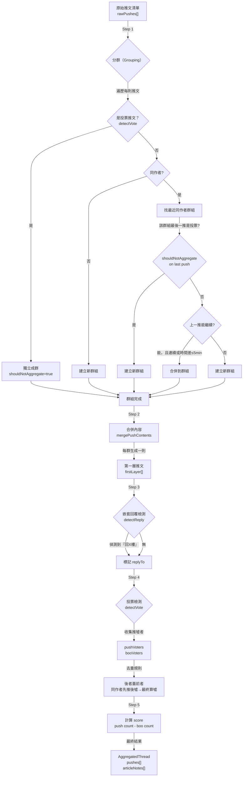

# 推文聚合與回覆處理規則

## 概述

PTT 推文需要經過三個關鍵步驟處理：
1. **分群（Grouping）** — 將同作者的推文分組，判斷是否可合併
2. **聚合（Merging）** — 將同群推文合成一則，生成最終內容
3. **嵌套與投票檢測（Nesting & Vote Detection）** — 識別回覆關係與投票操作

---

## 核心規則（Pseudocode 形式）

### Rule 1：推文分群 (Step 1: Grouping)

```pseudocode
function groupPushes(rawPushes):
  groups = []
  
  for each rawPush in rawPushes:
    if no same-author group exists:
      create new group with [rawPush]
      continue
    
    // 找該作者最近的群組
    sameAuthorGroup = findLatestGroupByAuthor(rawPush.author)
    lastPush = sameAuthorGroup.last()
    prevGlobal = rawPushes[index - 1]
    
    // 判斷是否可繼續聚合
    if lastPush can continue AND (consecutive OR timeGap <= 5min):
      append rawPush to sameAuthorGroup
    else:
      create new group with [rawPush]
  
  return groups
```

**可繼續聚合條件：**
- `canContinueFromPush(lastPush)` 為 true：
  - 內容末尾無終止符 `.！？；;。` 或
  - 明確標記 `||` 續接符
- **且** 滿足其一：
  - 前一則全域推文同作者（連續）**或**
  - 時間差 ≤ 5 分鐘

---

### Rule 2：推文合併 (Step 2: Content Merging)

```pseudocode
function mergePushContents(pushes):
  if pushes is empty:
    return ""
  
  merged = stripContinuationMarker(pushes[0].content)
  
  for i = 1 to pushes.length - 1:
    previous = pushes[i - 1]
    current = stripContinuationMarker(pushes[i].content)
    
    // 判斷分隔符
    if isFullPushLine(previous):
      separator = ""  // 滿行直接銜接
    else:
      separator = "\n"  // 非滿行加換行
    
    merged += separator + current
  
  return merged
```

**判斷滿行邏輯：**
- 若內容 Big5 bytes ≥ 37 → 認為「滿行」
- 若明確標記 `isFullWidthLine` → 優先使用標記

---

### Rule 3：優先檢測投票（新增）

```pseudocode
function shouldNotAggregate(push):
  // **重點：優先檢測投票，避免與聚合規則衝突**
  
  vote = detectVote(push.content)
  
  if vote is not null:
    // 此推文是純投票操作（推X樓 / 噓X樓）
    // 不聚合，獨立成一則推文
    return true
  
  return false


function groupPushes(rawPushes):
  groups = []
  
  for each rawPush in rawPushes:
    
    // **優先檢測投票**
    if shouldNotAggregate(rawPush):
      create new group with [rawPush]  // 獨立成群，不與前推合併
      continue
    
    // 以下為原有的聚合邏輯...
    if no same-author group exists:
      create new group with [rawPush]
      continue
    
    sameAuthorGroup = findLatestGroupByAuthor(rawPush.author)
    lastPush = sameAuthorGroup.last()
    
    // **不與投票推聚合**
    if shouldNotAggregate(lastPush):
      create new group with [rawPush]
      continue
    
    // 檢查可繼續聚合條件（同原規則）
    prevGlobal = rawPushes[index - 1]
    if lastPush can continue AND (consecutive OR timeGap <= 5min):
      append rawPush to sameAuthorGroup
    else:
      create new group with [rawPush]
  
  return groups
```

---

### Rule 4：嵌套回覆檢測 (Step 3a: Detect Nested Replies)

```pseudocode
function detectReply(content):
  // 檢測「回X樓：」/ 「回XF」等模式
  
  patterns = [
    /^回\s*(\d+)\s*樓\s*[：:]?\s*/,
    /^回\s*(\d+)\s*F\b\s*[：:]?\s*/,
    /^to\s*(\d+)\s*F\b\s*[：:]?\s*/,
    ...
  ]
  
  for each pattern in patterns:
    match = content.match(pattern)
    if match:
      floorNumber = parseFloorNumber(match[1])
      if floorNumber is valid:
        return {
          targetFloor: floorNumber,
          strippedContent: content.slice(match[0].length)
        }
  
  return null
```

**回覆模式（支援中文數字）：**
- `回0樓：...` / `回一樓：...`
- `回0F：...` / `回0f...`
- `to 0F...` / `reply to 0F...`
- `>>0F...`

---

### Rule 5：投票檢測 (Step 3b: Detect Votes)

```pseudocode
function detectVote(content):
  // 檢測「推X樓」/ 「噓X樓」等投票模式
  
  patterns = [
    { re: /^推\s*(\d+)\s*樓/i, direction: "push" },
    { re: /^(\d+)\s*樓推一個/i, direction: "push" },
    { re: /^噓\s*(\d+)\s*樓/i, direction: "boo" },
  ]
  
  for each pattern in patterns:
    match = content.match(pattern.re)
    if match:
      floorNumber = parseFloorNumber(match[1])
      if floorNumber is valid:
        return {
          targetFloor: floorNumber,
          direction: pattern.direction
        }
  
  return null
```

**投票模式（支援中文數字）：**
- `推0樓` — 推該樓層
- `0樓推一個` — 推該樓層（替代形式）
- `噓0樓` — 噓該樓層

---

### Rule 6：投票去重 (Step 4: Vote Deduplication)

```pseudocode
function collectVoters(firstLayer, rawPushes):
  voterMap = Map<pushId, Map<author, "push"|"boo">>
  
  for each rawPush in rawPushes:
    vote = detectVote(rawPush.content)
    
    if vote is null:
      continue  // 非投票推文
    
    // 找到被投票的推文
    target = findFirstLayerPushByFloor(vote.targetFloor)
    
    if target is null:
      continue  // 目標樓層不存在
    
    if voterMap[target.id] doesn't exist:
      voterMap[target.id] = new Map()
    
    authorMap = voterMap[target.id]
    previous = authorMap.get(rawPush.author)
    
    // **去重規則：後者蓋前者（同作者先推後噓，最終算噓）**
    if previous == vote.direction:
      continue  // 重複投票，無變化
    
    if previous == "push":
      target.pushVoters.remove(rawPush.author)
    else if previous == "boo":
      target.booVoters.remove(rawPush.author)
    
    // 加入新方向
    if vote.direction == "push":
      target.pushVoters.add(rawPush.author)
    else:
      target.booVoters.add(rawPush.author)
    
    authorMap.set(rawPush.author, vote.direction)
```

---

## 完整流程圖



---

## 設計選擇：優先投票檢測

### 問題
當某個推文被識別為投票（例如「推0樓」）時，原有的聚合邏輯仍會嘗試與下一則推文合併，這造成兩個衝突：

1. 投票操作應該獨立記錄，不應與其他內容混合
2. 投票內容可能很短（如「推0樓」），若聚合到下一推會失去語義

### 解決方案
**優先檢測投票，禁止聚合**

在分群時，一旦發現某推為投票操作，立即：
- 該推文獨立成群，不與前一推聚合
- 下一推如果有同作者，也應建立新群組（除非連續且前推能繼續）

### 邏輯順序
```
Step 1：分群時優先檢測投票
  ↓
if 是投票 → 獨立成群（無論前推是否能繼續）
  ↓
if 非投票 → 依照原聚合規則判斷

Step 4：投票去重時優先處理
  ↓
同作者對同推文先推後噓 → 最終紀錄為「噓」
```

---

## 邊界案例

### Case 1：同作者連續投票
```
user1: 推0樓
user1: 推1樓
```
→ 各成一群（因優先檢測投票，不聚合）

### Case 2：投票後跟著回文
```
user1: 推0樓
user1: 回2樓：贊成
```
→ 第一群：`推0樓`（投票，獨立）
→ 第二群：`回2樓：贊成`（回覆，獨立）

### Case 3：普通回覆後跟投票
```
user1: 我也贊成
user1: 推0樓
```
→ 因「我也贊成」末尾無終止符，可繼續，但下推是投票 → 獨立成群
→ 第一群：`我也贊成`
→ 第二群：`推0樓`

### Case 4：同作者先推後噓去重
```
user1: 推0樓  ← 記錄 pushVoters += user1
user1: 噓0樓  ← 發現 user1 已投過，移除 pushVoters，加入 booVoters
```
→ 最終 `target.booVoters` 含有 `user1`，`pushVoters` 不含

---

## 實裝檢查清單

- [x] `detectVote()` 函式已實裝，支援中文數字
- [x] `groupPushes()` 已加入 `shouldNotAggregate()` 檢查
- [x] Step 4 投票去重邏輯完整
- [ ] 單元測試覆蓋投票聚合邊界案例
- [ ] 集成測試確認推文聚合無迴歸

---

## 相關文件

- `src/lib/ppt/pushAggregator.ts` — 核心實裝
- `src/lib/ppt/__tests__/pushAggregator.test.ts` — 單元測試
- Goal 7 實作計畫 — `dev-notes/goal-7-implementation-plan.md`
